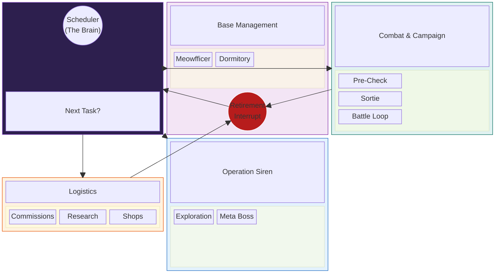

# Experimental ALAS System Map

This diagram uses the experimental `block-beta` syntax to visualize the ALAS system architecture as a nested block layout. It groups tools into their respective domains physically rather than just logically.

## Explanation
*   **Columns:** The layout uses a 3-column grid.
*   **Nested Blocks:** Each domain (Combat, Management, etc.) is its own "block" containing sub-tools.
*   **The Red Node:** The `Retirement Interrupt` is visually placed inside Management but connected to Combat and Logistics to show how it "pulls" control away from them.
